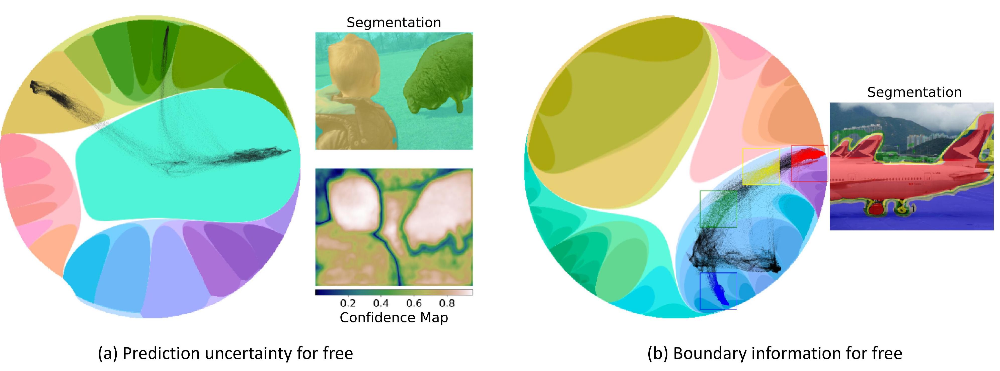

# Hyperbolic Image Segmentation, CVPR 2022

This is the implementation of paper [Hyperbolic Image Segmentation (CVPR 2022)](https://arxiv.org/pdf/2203.05898.pdf).



## Repository structure 

- <b>assets </b>: images and stuff
- <b>datasets </b>: contains integer to class dictionaries, and JSON files that contain the hierarchies used. (ADE does not have one yet)
- <b>hesp </b>: the actual code containing layers, models, losses, etc.
- <b>samples </b>: helper files, bash scripts, and train.py

**Code is not complete yet.**

## How to use the code?

For installation, first run <code> pip install -e .</code>  to register the package.

Then, run <code>sh requirements.sh</code> to install the requirements. 

The code needs Tensorflow 1, 
the experiments are performed using Tensorflow 1.14. The tensorflow installed by the script is tensorflow-cpu. Change the commands to install tensorflow on GPU.


## Citation
Please consider citing this work using this BibTex entry,

```bibtex
@article{ghadimiatigh2022hyperbolic,
  title={Hyperbolic Image Segmentation},
  author={GhadimiAtigh, Mina and Schoep, Julian and Acar, Erman and van Noord, Nanne and Mettes, Pascal},
  journal={arXiv preprint arXiv:2203.05898},
  year={2022}
}
```
